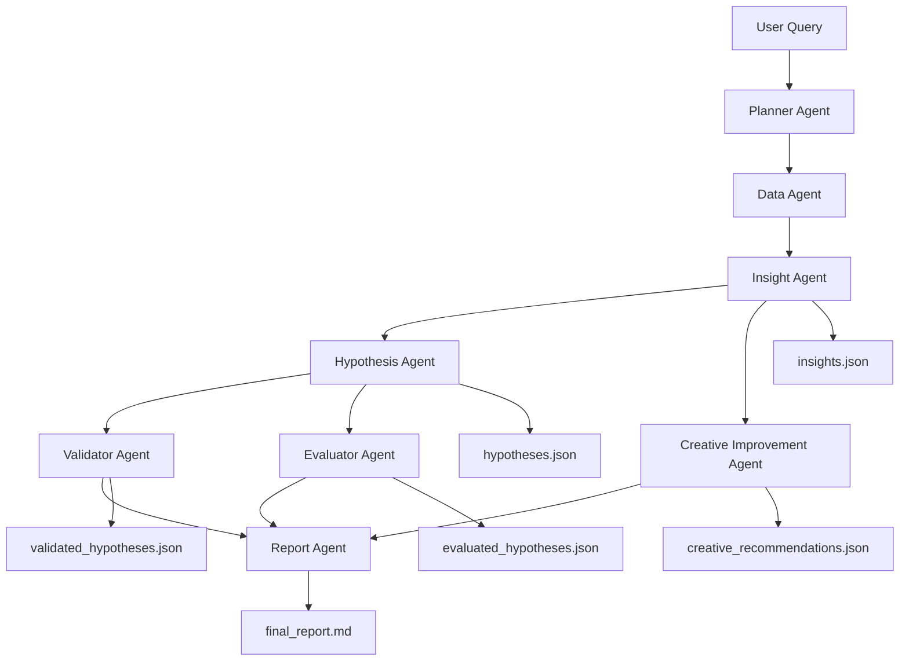

# Agent Graph & System Design Documentation

## Overview
This project implements a modular Agentic Marketing Analytics System designed to ingest ad performance data, analyze patterns, produce insights and hypotheses, validate them, generate creative improvements, and output a final marketer‑ready report.

Each agent is fully isolated, produces structured JSON, and passes outputs downstream into the pipeline.

---

## Agent Graph (Data Flow)

---

## Agent Roles

### **1. Planner Agent**
Breaks user query into executable subtasks:
- Load dataset  
- Compute metrics  
- Generate insights  
- Generate hypotheses  
- Validate hypotheses  
- Generate creatives  
- Create final report  

### **2. Data Agent**
Loads CSV → computes:
- CTR, ROAS, CPC, CPM  
- Audience performance  
- Country performance  
- Platform performance  
- Creative fatigue signals  
- Top/worst creatives  

Outputs **metrics dict**.

### **3. Insight Agent**
Transforms metrics → insights.  
Produces:
- Summary  
- 3–8 insights  
- Evidence (KPI trends, audience signals, creative issues)  
- Severity & confidence  

Outputs **insights.json**.

### **4. Hypothesis Agent**
Converts insights into 5–10 hypotheses:
- Issue  
- Testable hypothesis  
- Supporting signals  
- Confidence  

Outputs **hypotheses.json**.

### **5. Validator Agent**
Validates each hypothesis:
- validated / rejected / partial  
- strengthened reasoning  

Outputs **validated_hypotheses.json**.

### **6. Evaluator Agent**
Adds numerical justification:
- quantitative support  
- strength_score  
- confidence  

Outputs **evaluated_hypotheses.json**.

### **7. Creative Improvement Agent**
Improves low‑CTR creatives by generating:
- New headline  
- New primary text  
- Hooks  
- Expected lift  

Outputs **creative_recommendations.json**.

### **8. Report Agent**
Generates full **Markdown report** using:
- metrics  
- insights  
- hypotheses  
- validations  
- creative recommendations  

Outputs **final_report.md**.

---

## File Outputs (Deliverables)

| File | Description |
|------|-------------|
| insights.json | Generated insights (structured) |
| hypotheses.json | Hypotheses derived from insights |
| validated_hypotheses.json | Validator results |
| evaluated_hypotheses.json | Numerical evaluation |
| creative_recommendations.json | Improved creatives |
| final_report.md | Final marketer report |
| agent_graph.md | Design documentation |

---

## Architecture Summary
This system follows a deterministic linear agent pipeline with retries and JSON validation at each step.  
Artifacts remain stored in `/results` for reproducibility.

